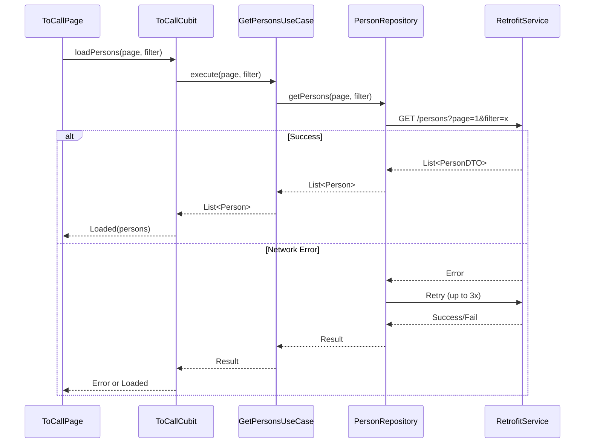
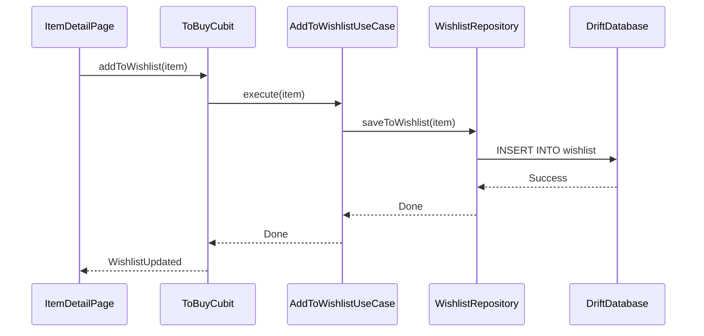
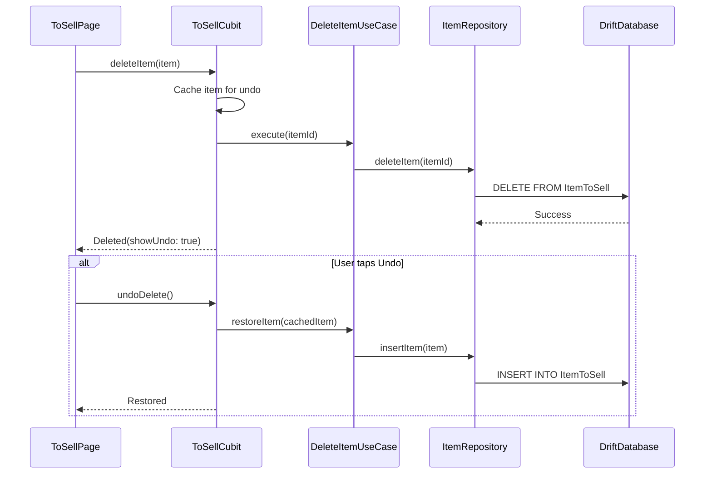
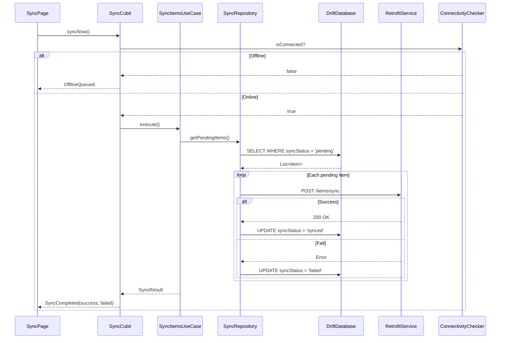

# Todo App

A Flutter application demonstrating Clean Architecture with offline-first sync capabilities.

---

# I. How to Run

Install Flutter 3.38.3 (Or install via fvm and add "fvm" before every flutter command)
Install fvm from https://fvm.app/documentation/getting-started/installation

```bash
fvm install 3.38.3
```

Get app dependencies:

```bash
fvm flutter pub get
```

Run the app:

```bash
fvm flutter run
```

---

# II. App Features

Based on the requirements in [REQUIREMENT](./REQUIREMENT.md), I design my app as an Jewelry Store app with these features.

| Module | Feature | Key Functions |
|--------|---------|---------------|
| **To Call** | Contact Sales Team | Pagination, filtering, retry logic |
| **To Buy** | Buy Jewelry | Sorting, filtering, detail page, wishlist (local) |
| **To Sell** | Sell Jewelry | Full CRUD, validation, bulk delete, undo |
| **Sync** | Sync Data | Offline-first, manual + background sync |

### User Story

**Contact Sales Team:** Users browse a paginated list of sales representatives, filter by criteria, and tap to call directly.

**Buy Jewelry:** Users explore the jewelry catalog with sorting and filtering options, view product details, and add favorites to a local wishlist. Upon successful purchase, the item is saved locally as a "sell item."

**Sell Jewelry:** Users manage their inventory—view purchased items, create new products, edit details, or delete entries. Bulk delete and undo actions are supported.

**Sync:** When a user sells an item, the app updates the local database and syncs with the server. If offline, changes are queued and automatically synced when connectivity is restored.

**Notifications:** The app listens to real-time marketing events, displays push notifications, and maintains a viewable notification history.

---

# III. ADR (Architectural Decision Record)
Refer the [Architecture Decision Record](./ADR.md) file

# IV. Mock API

No external server setup required. Mock data is handled internally via Dio interceptor.

**File:** [`lib/data/data_source/network/mock/mock_interceptor.dart`](./lib/data/data_source/network/mock/mock_interceptor.dart)

This helps us keep the production code with real REST API implementation without changing too much for mocking data.
We can easily toggle the environment in [`app_config.dart`](./lib/application/app_config.dart) and the app won't use `MockInterceptor`.

Notifications are also mocked by [`MarketingNotificationRepositoryImpl`](./lib/data/repositories/marketing_notification/marketing_notification_repository_impl.dart), which exposes a stream of scheduled notifications using templates from [`marketing_notification_mock_data.dart`](./lib/data/data_source/local/mock/marketing_notification_mock_data.dart).

---

# IV. Architecture

## Folder Structure

```
lib/
├── application/
│   ├── resource/            # App resources (strings, images, styles, colors, fonts)
│   └── util/                # Helpers, extensions
│
├── data/
│   ├── data_source/
│   │   ├── local/           # Drift database
│   │   └── network/         # Retrofit API, Dio interceptors, models
│   ├── di/                  # service_locator.dart (get_it setup)
│   └── repositories/        # Repository implementations
│
├── domain/
│   ├── entities/            # Pure business objects
│   ├── repositories/        # Abstract repository contracts
│   └── use_cases/           # Single-purpose business logic
│
└── presentation/
    ├── screens/             # Feature screens with bloc/ and widgets/
    ├── globals/             # Global states and providers
    ├── custom_widgets/      # Reusable UI components
    ├── navigation/          # App routing and observers
    └── base_bloc/           # Base Cubit/Bloc classes
```

## Dependency Injection

We use [`service_locator.dart`](./lib/data/di/service_locator.dart) with **get_it** for runtime dependency injection. All repositories, use cases, and blocs are registered at app startup and resolved lazily when needed.

## Layer Justification

| Layer | Why Separate? |
|-------|---------------|
| **application/** | Shared resources and utilities across all features. |
| **data/** | Isolates external dependencies (API, DB). Contains DI setup via service_locator. |
| **domain/** | Pure Dart, no Flutter imports. Business logic stays testable. |
| **presentation/** | UI-only concerns. Cubits handle state, screens compose widgets. |

## Data Flow

```
┌─────────────┐     ┌─────────────┐     ┌─────────────┐     ┌─────────────┐
│ Presentation│────▶│   Domain    │────▶│    Data     │────▶│  External   │
│   (Cubit)   │     │  (UseCase)  │     │ (Repository)│     │ (API / DB)  │
└─────────────┘     └─────────────┘     └─────────────┘     └─────────────┘
```

**Key Principle:** Dependencies point inward. Domain knows nothing about Data or Presentation.

---

# V. Sequence Diagrams

### 1. To-Call: Fetch with Pagination & Retry



### 2. To-Buy: Add to Wishlist (Local Storage)



### 3. To-Sell: CRUD with Undo Delete



### 4. Sync: Offline-First Flow



---

# VI. Unit Tests

We use **mocktail** for mocking dependencies, following the AAA pattern (Arrange, Act, Assert).

## Run Tests

```bash
fvm flutter test
```

## Test Coverage

| Layer | File | Tests |
|-------|------|-------|
| **Domain** | [`get_sales_members_test.dart`](./test/domain/use_cases/sales_member/get_sales_members_test.dart) | UseCase logic, DTO→Entity conversion, error propagation |
| **Data** | [`sales_member_repository_impl_test.dart`](./test/data/repositories/sales_member/sales_member_repository_impl_test.dart) | Repository calls, parameter passing, exception handling |

## Test Structure

```
test/
├── domain/
│   └── use_cases/
│       └── sales_member/
│           └── get_sales_members_test.dart
└── data/
    └── repositories/
        └── sales_member/
            └── sales_member_repository_impl_test.dart
```
